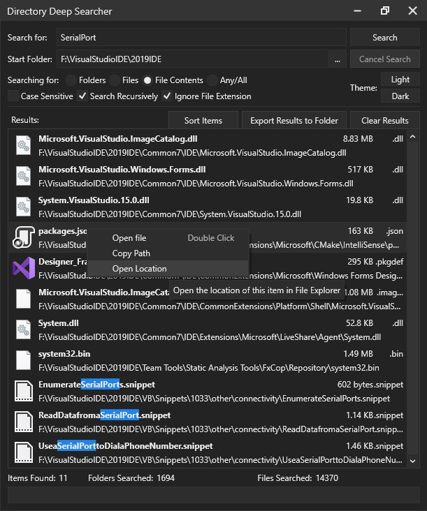

# FolderDeepSearch
A simple program for deep searching through folders, files and file contents to search for a specific string of text. 

Can select between searching only in the selected folder, or search recursively though every single subdirectory.

Searching contents uses a filestream to constantly read a 1kb chunk from the file. this is better than loading the entire file into memory and then searching that.

# Controls
At the top is the "Search For" text. this is the text you want to search for. To the right is the start/cancel buttons to start/cancel the search (the search is async so there's no lag... well unless you search for a file which exists 10,000s of times then it might lag a bit due to all the items being put in the results list).
Below that is the start folder. this is where the search will start.

Below that is the searching preferences. You can select to search for a folder, file, the contents of a file, or all 3. folder/file search is very quick (i tested it with 5000 folders and 50,000 files... done in 1 second). however searching contents takes a lot longer. the file content is searched in chunks of 1 kb so that the entire file's content isn't loaded into memory which is bad.

Below that is some checkboxes. Case sensitive will determind whether to pay attention to cAsEs or ignore them (e.g, search for something or SomeThing). Search recursively searches through every single subfolder of subfolders of subfolders, etc. It will basically continue searching until there's no more folders. ignore file extension, bit useless but basically if you want to find a specific file with a specific extension (like myFile.idkwhythisisanextension), then simply put idkwhythisisanextension in the search for box and unselect ignore file extension.

To the right of that is the theme buttons. i made a theme pack a while ago featuring 4 themes; colourful and normal, dark and light themes. this only has normal light and dark.
below that is the results list with some buttons on top. you can sort the items (firstly by name and then by type; folders at top, files below). you can export every FILE found to another folder (by copying it) or clear the results. and then the results list. this contains items which preview the file's icon, it's name, path, size and extension (i kinda copied the design from OpenIV's search feature because it looks kinda nice). you can right click these items to open the file (e.g. open text file in notepad or something), copy the path to the clipboard or open file explorer in the file's location and also select the file.

finally at the bottom is the amount of items found, the number of folders searched and the number of files searched. and below that is a progress bar which will do that cycling thing when a search is in progress

(Also in the image, some items at the bottom, their file name is highlighted blue a bit. this is a bit of a bug and it's only supposed to be blue if you're searching for a file or folder, it isn't meant to do it for contents but oh well. those files that are highlighted, their contents does actually contain "serialport" (ignore case was on) so it's not really a big problem tbh)
